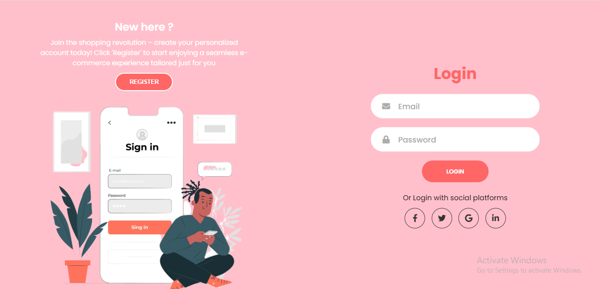
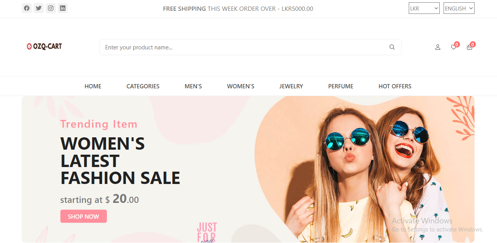
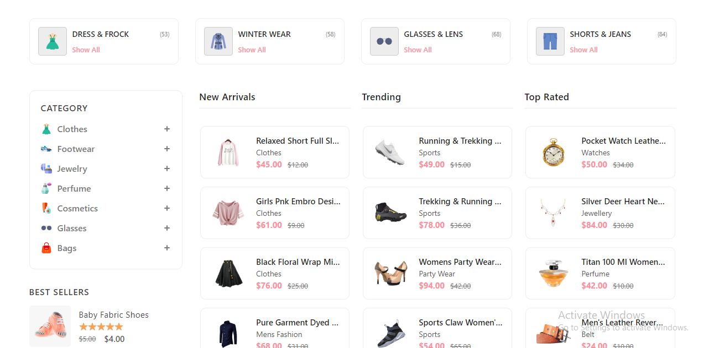
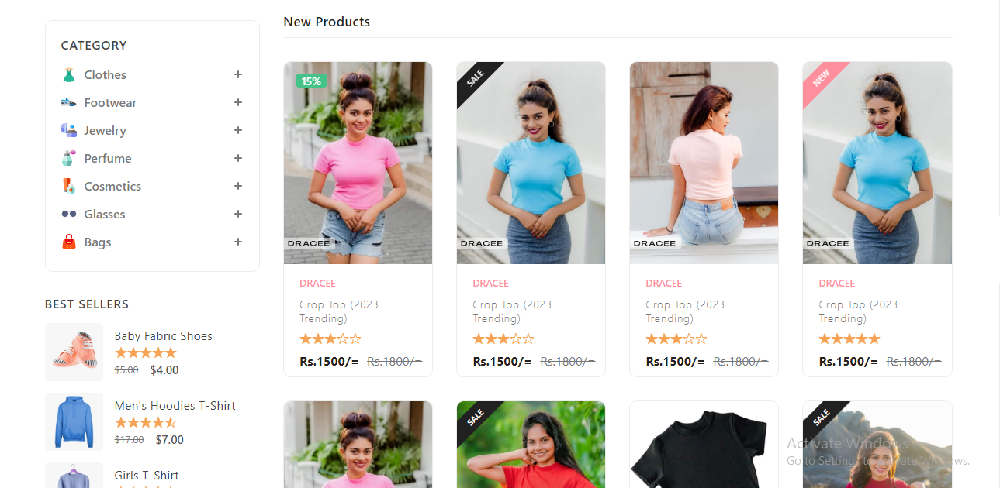
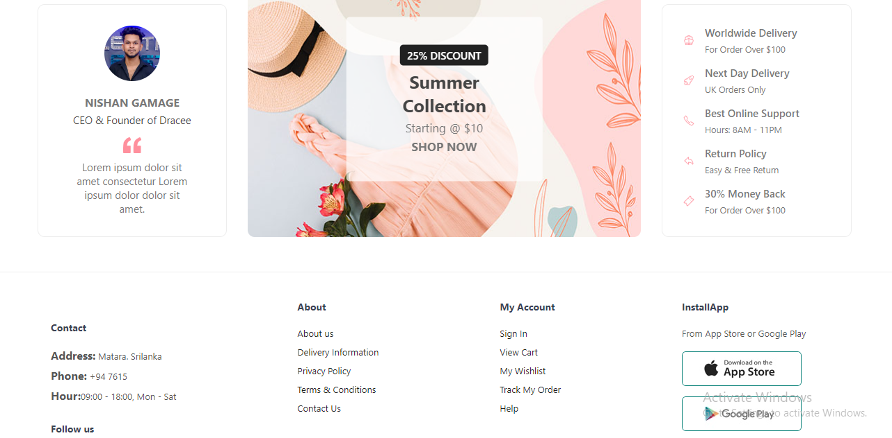
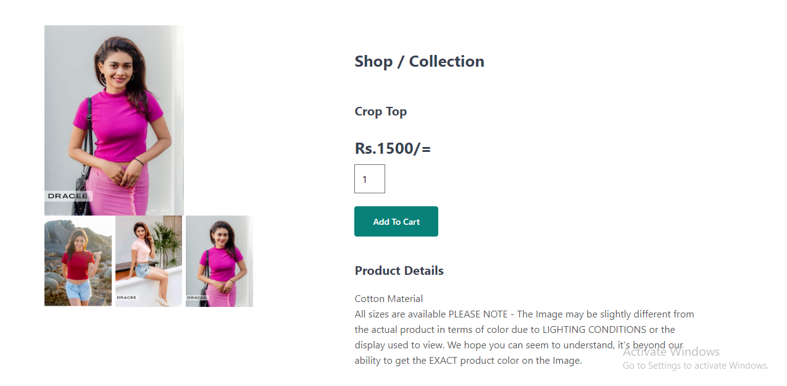

<h1 align="center">👗 OZQ Clothing – E-commerce Website</h1>

<p align="center">
  Developed as part of the <strong>API Module</strong> for academic purposes, this project demonstrates key web development concepts including secure customer authentication, dynamic content display, and role-based reporting.
</p>


## 🌟 Key Features

- 🧍‍♀️ **Customer Features**
  - Secure registration & login
  - Browse product catalog with real-time availability
  - Cash-on-delivery checkout system

---

## 🌐 Tech Stack

<p align="left">
  
  
  
  
  
</p>

---

## 📸 Screenshots








<p align="center">  </p> <p align="center"> <sub> © 2025 BAUHINIA Clothing<br> Developed by <strong>Nishan Gamage</strong> for academic use only.<br> <strong>All rights reserved.</strong> </sub> </p> ```
